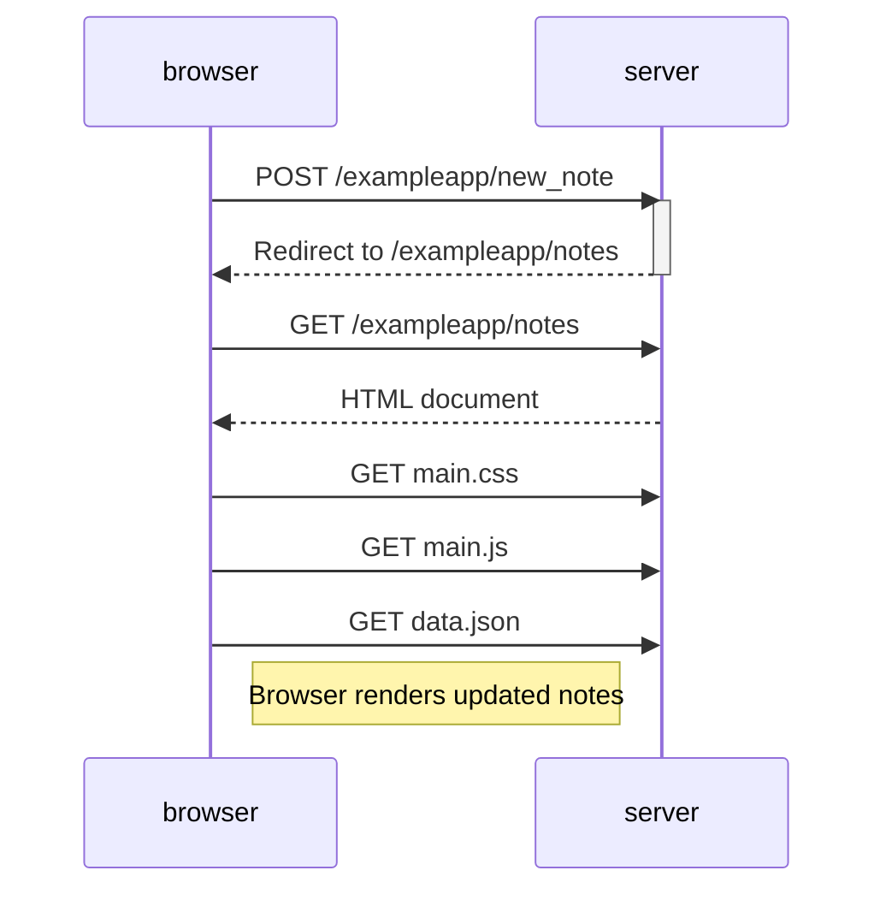

```mermaid
sequenceDiagram
    participant browser
    participant server

    browser->>server: POST /exampleapp/new_note
    activate server
    server-->>browser: Redirect to /exampleapp/notes
    deactivate server

    browser->>server: GET /exampleapp/notes
    server-->>browser: HTML document
    browser->>server: GET main.css
    browser->>server: GET main.js
    browser->>server: GET data.json

    Note right of browser: Browser renders updated notes
```