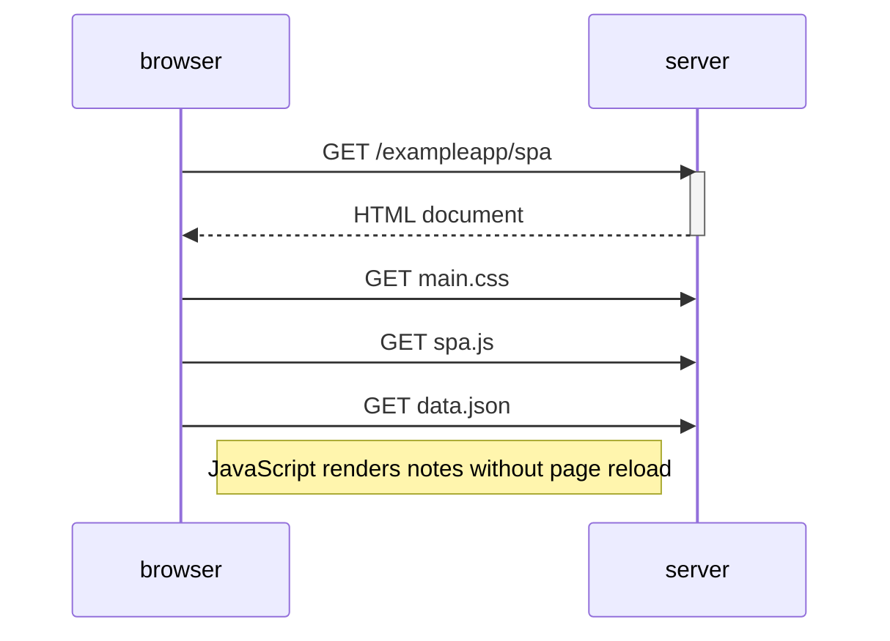

```mermaid
sequenceDiagram
    participant browser
    participant server

    browser->>server: GET /exampleapp/spa
    activate server
    server-->>browser: HTML document
    deactivate server

    browser->>server: GET main.css
    browser->>server: GET spa.js
    browser->>server: GET data.json

    Note right of browser: JavaScript renders notes without page reload
```